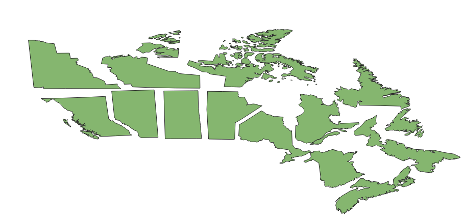
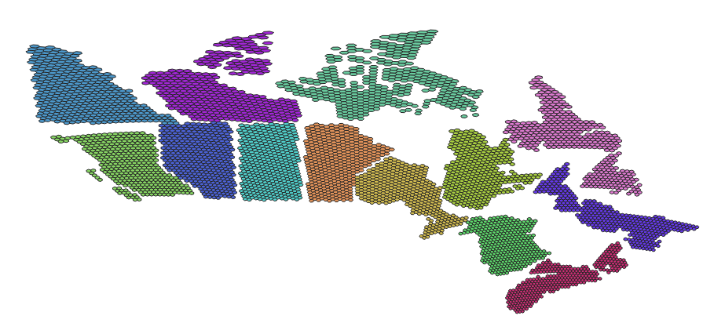
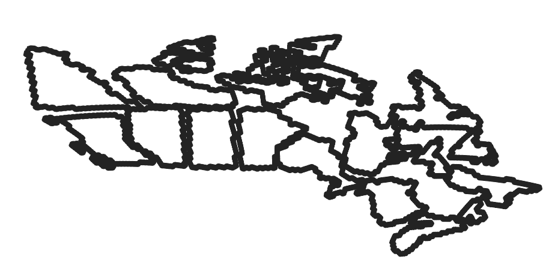

# exploded_canada

Alternative shape files for representing Province Territory level data , can be used as replacement for bar chart or stacked percentage bar chart

### Canada_T

Canada Transformed so all the provinces have the same surface area, making it easier to find the smalle provinces.

### Canada_T_Hex 

Canada_T but each province now has an equal number of Hexs..

### Canada_T_Hex_DIS

Canada_T_Hex, but the hexs are now dissolved. 

